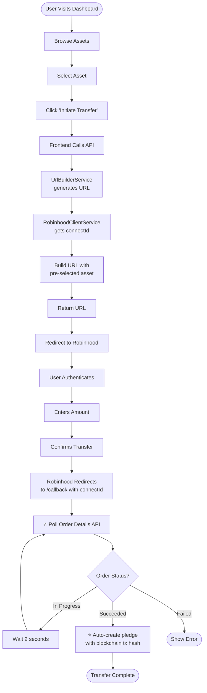
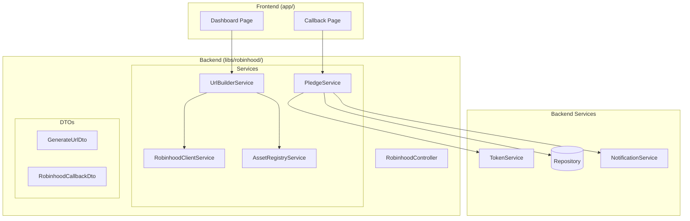
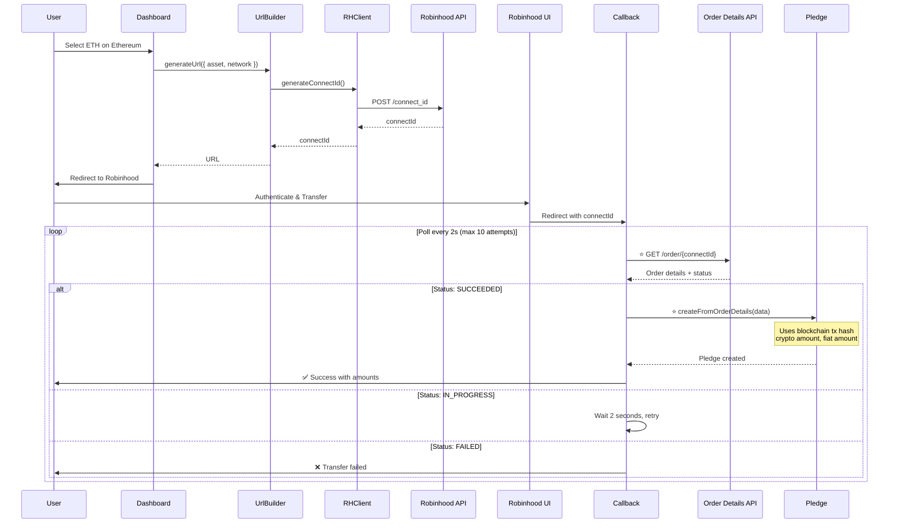
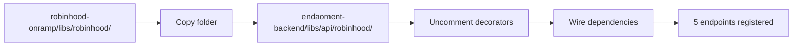
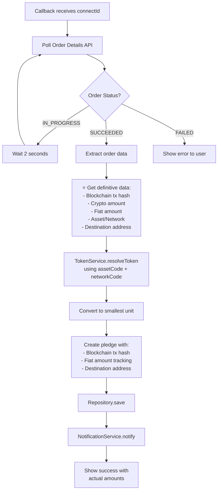
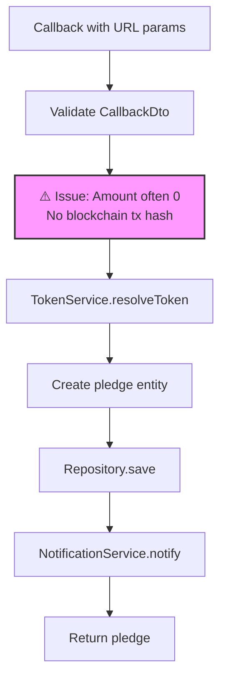

# Flow Diagrams

> Visual flows for the Robinhood Connect integration.

## User Flow

## Service Architecture

## Sequence Diagram

## Migration Flow

## Pledge Creation Flow (New - Order Details API)

## Legacy Pledge Creation Flow (Deprecated)

## Viewing Diagrams

**GitHub**: Renders mermaid automatically  
**Locally**: Use Mermaid CLI or mermaid.live  
**VSCode**: Install Mermaid extension

## Documentation

- [ARCHITECTURE.md](./ARCHITECTURE.md) - System architecture
- [MIGRATION-GUIDE.md](./MIGRATION-GUIDE.md) - Backend migration
