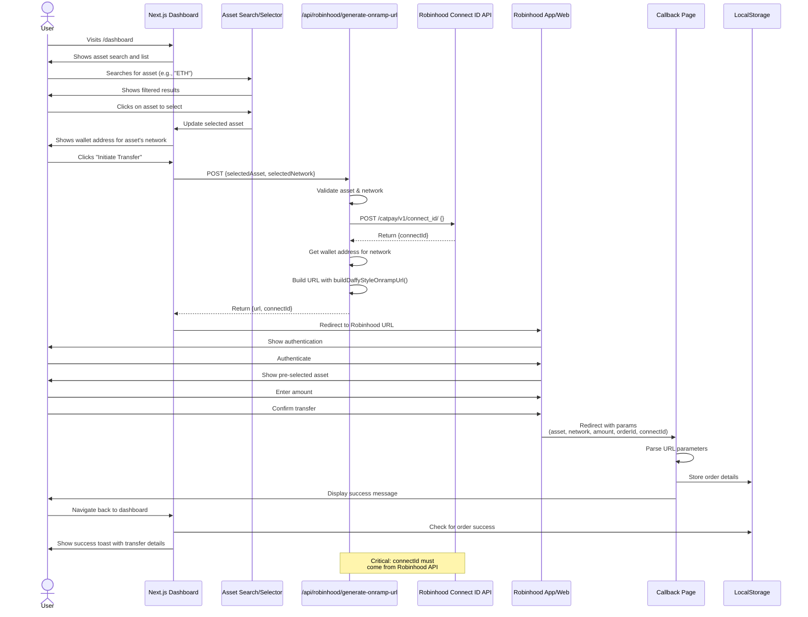
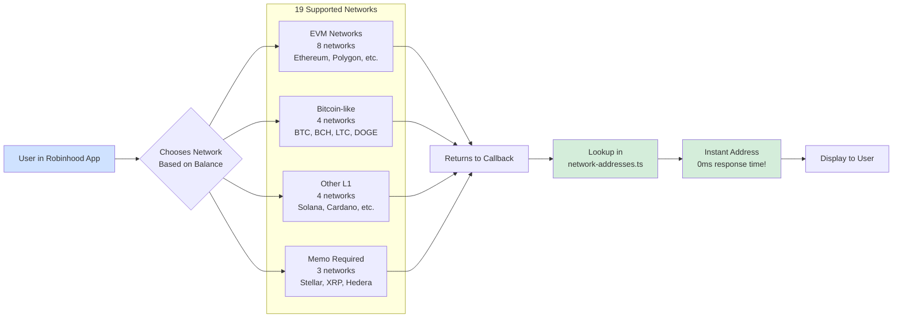
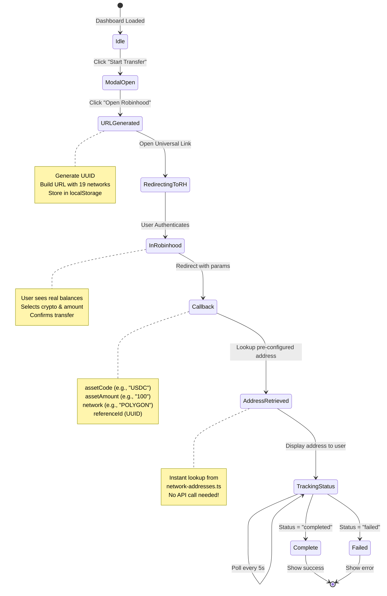
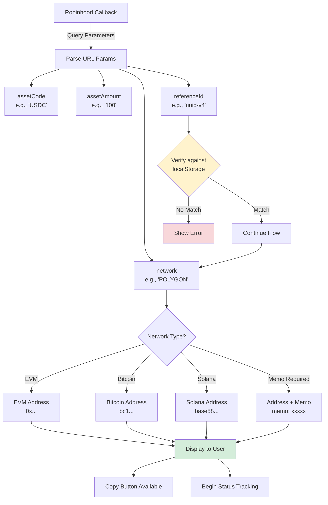
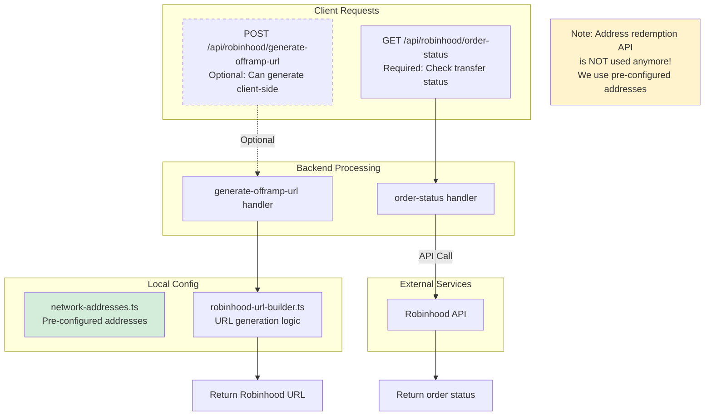
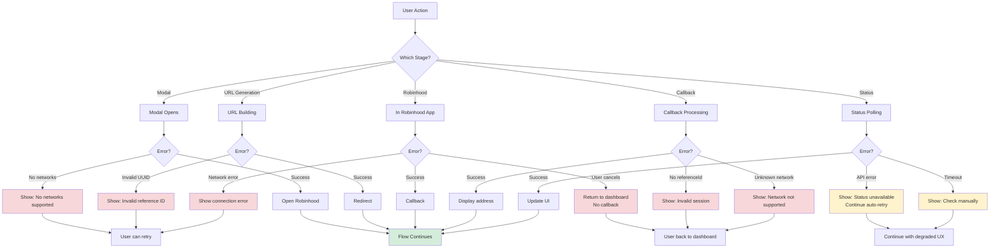

# Robinhood Connect - Flow Diagrams

This document contains visual representations of the Robinhood Connect asset pre-selection onramp flow.

---

## 1. High-Level User Flow (Asset Pre-Selection)

```mermaid
flowchart TD
    Start([User Visits Dashboard]) --> Search[User Searches/Browses Assets]
    Search --> Select[User Selects Cryptocurrency<br/>e.g., ETH, SOL, USDC]
    Select --> ShowAddress[System Shows Wallet Address<br/>for Asset's Network]
    ShowAddress --> InitiateBtn[User Clicks 'Initiate Transfer']
    
    InitiateBtn --> CallAPI[Frontend Calls<br/>/api/robinhood/generate-onramp-url]
    CallAPI --> GetConnectId[Backend Calls Robinhood<br/>POST /catpay/v1/connect_id/]
    GetConnectId --> BuildURL[Backend Builds URL<br/>with Pre-Selected Asset]
    BuildURL --> ReturnURL[Backend Returns URL<br/>to Frontend]
    
    ReturnURL --> Redirect[Redirect to Robinhood<br/>Asset Pre-Selected]
    Redirect --> RHAuth[User Authenticates in Robinhood]
    RHAuth --> RHAmount[User Enters Amount<br/>for Pre-Selected Asset]
    RHAmount --> RHConfirm[User Confirms Transfer]

    RHConfirm --> Callback[Robinhood Redirects to /callback<br/>with asset, network, amount, orderId]
    Callback --> ShowSuccess[Display Success Message<br/>with Transfer Details]
    ShowSuccess --> Dashboard[User Returns to Dashboard]
    Dashboard --> Toast[Success Toast Displays<br/>with Full Transfer Info]
    Toast --> Complete([Transfer Complete])

    style Start fill:#e1f5e1
    style Complete fill:#e1f5e1
    style Select fill:#cfe2ff
    style GetConnectId fill:#fff3cd
    style Redirect fill:#d4edda
```



---

## 2. Detailed Sequence Diagram (Asset Pre-Selection)



---

## 3. System Architecture Diagram

```mermaid
graph TB
    subgraph "Client Side (Browser)"
        Dashboard[Dashboard Component]
        Modal[Offramp Modal Component]
        Callback[Callback Page]
        Status[Order Status Component]
        LocalStorage[(localStorage<br/>referenceId)]
    end

    subgraph "Next.js Backend"
        GenerateURL[/api/robinhood/generate-offramp-url<br/>Optional - can use client-side]
        StatusEndpoint[/api/robinhood/order-status]
        NetworkAddresses[lib/network-addresses.ts<br/>Pre-configured addresses<br/>19 networks]
        URLBuilder[lib/robinhood-url-builder.ts]
    end

    subgraph "Robinhood Services"
        RHConnect[Robinhood Connect<br/>Universal Link]
        RHApp[Robinhood App/Web]
        RHAPI[Robinhood API<br/>Order Status]
    end

    Dashboard -->|1. User clicks button| Modal
    Modal -->|2. Generate UUID| LocalStorage
    Modal -->|3. Build URL| URLBuilder
    URLBuilder -->|4. Redirect| RHConnect
    RHConnect -->|5. Open app| RHApp
    RHApp -->|6. Callback redirect| Callback
    Callback -->|7. Verify referenceId| LocalStorage
    Callback -->|8. Get address| NetworkAddresses
    Callback -->|9. Poll status| StatusEndpoint
    StatusEndpoint -->|10. Check order| RHAPI
    Status -->|Auto-refresh| StatusEndpoint

    style NetworkAddresses fill:#d4edda
    style Modal fill:#fff3cd
    style RHAPI fill:#f8d7da
    style Callback fill:#cfe2ff
```

---

## 4. Network Selection & Address Retrieval



---

## 5. State Management Flow



---

## 6. Data Flow - Callback Parameters



---

## 7. API Endpoint Flow



---

## 8. Error Handling Flow



---

## Key Features Highlighted in Diagrams

### 🎯 Asset Pre-Selection

- User selects cryptocurrency before initiating transfer
- Asset is pre-selected in Robinhood (no confusion)
- Clear wallet address shown before transfer begins
- Proven to work reliably with external wallet transfers

### 🔑 Connect ID from Robinhood API

- Backend calls `/catpay/v1/connect_id/` to get valid connectId
- No random UUIDs in production
- Required for Robinhood Connect to work properly

### 📋 Pre-Configured Wallet Addresses

- Centralized address management in configuration files
- Addresses organized by network
- Instant address lookup (no API call needed)

### 🔄 Simple State Management

- Order details stored in localStorage
- Success toast displayed on dashboard return
- Minimal backend state required

### 🌐 19 Network Support

- 95% coverage of Robinhood networks
- EVM, Bitcoin-like, Layer 1s, and memo-required networks
- ~120 supported assets across all networks

---

## Usage

These diagrams can be:

- Embedded in documentation
- Used in presentations
- Rendered in GitHub (supports Mermaid natively)
- Exported to PNG/SVG using Mermaid CLI or online editors

To render locally:

```bash
# Install Mermaid CLI
npm install -g @mermaid-js/mermaid-cli

# Generate images
mmdc -i FLOW-DIAGRAMS.md -o output.png
```

---

**Created**: October 17, 2025  
**Related**: README.md, DEVELOPER_GUIDE.md, USER_GUIDE.md
