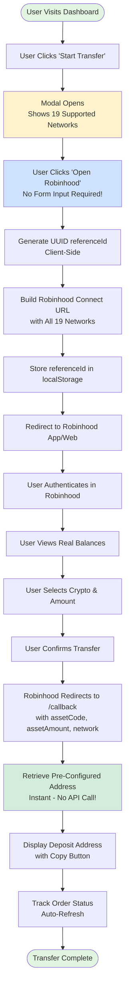
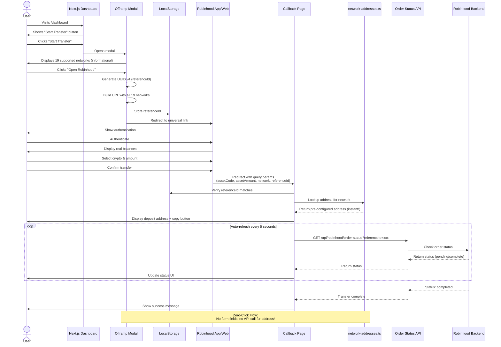
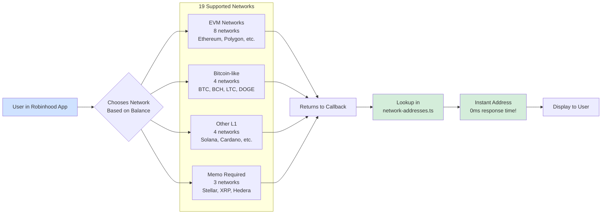
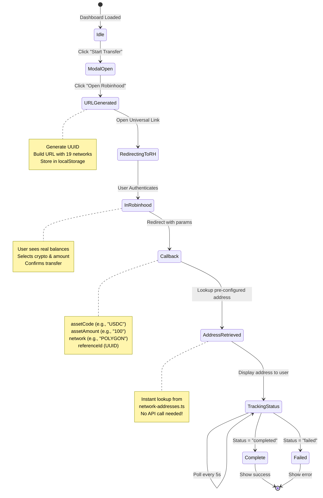
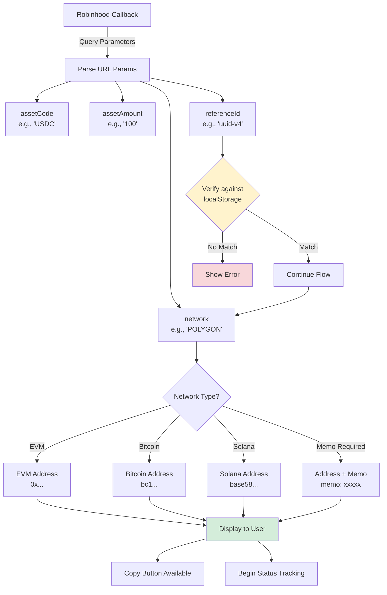
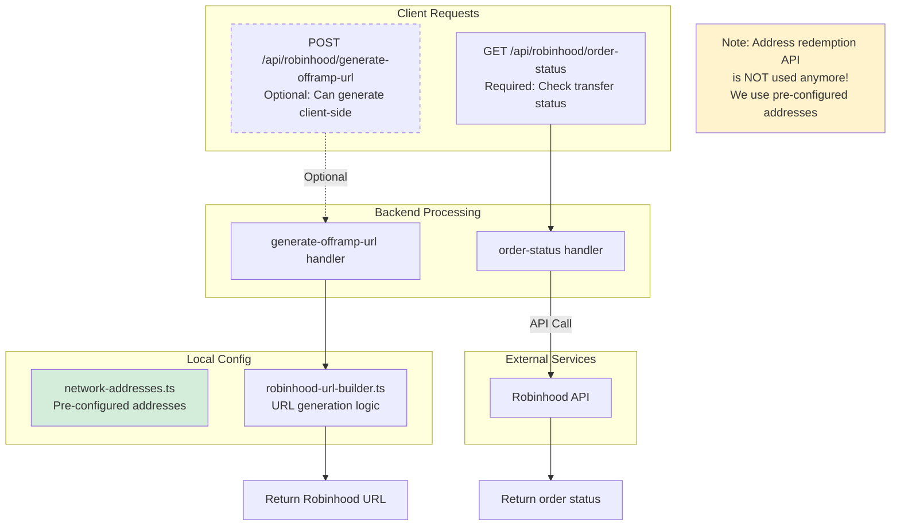
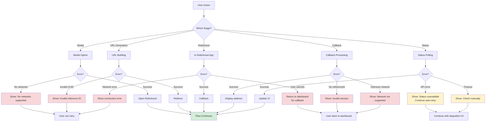

# Robinhood Connect - Flow Diagrams

This document contains visual representations of the Robinhood Connect onramp transfer flow.

---

## 1. High-Level User Flow



---

## 2. Detailed Sequence Diagram



---

## 3. System Architecture Diagram

```mermaid
graph TB
    subgraph "Client Side (Browser)"
        Dashboard[Dashboard Component]
        Modal[Offramp Modal Component]
        Callback[Callback Page]
        Status[Order Status Component]
        LocalStorage[(localStorage<br/>referenceId)]
    end

    subgraph "Next.js Backend"
        GenerateURL[/api/robinhood/generate-offramp-url<br/>Optional - can use client-side]
        StatusEndpoint[/api/robinhood/order-status]
        NetworkAddresses[lib/network-addresses.ts<br/>Pre-configured addresses<br/>19 networks]
        URLBuilder[lib/robinhood-url-builder.ts]
    end

    subgraph "Robinhood Services"
        RHConnect[Robinhood Connect<br/>Universal Link]
        RHApp[Robinhood App/Web]
        RHAPI[Robinhood API<br/>Order Status]
    end

    Dashboard -->|1. User clicks button| Modal
    Modal -->|2. Generate UUID| LocalStorage
    Modal -->|3. Build URL| URLBuilder
    URLBuilder -->|4. Redirect| RHConnect
    RHConnect -->|5. Open app| RHApp
    RHApp -->|6. Callback redirect| Callback
    Callback -->|7. Verify referenceId| LocalStorage
    Callback -->|8. Get address| NetworkAddresses
    Callback -->|9. Poll status| StatusEndpoint
    StatusEndpoint -->|10. Check order| RHAPI
    Status -->|Auto-refresh| StatusEndpoint

    style NetworkAddresses fill:#d4edda
    style Modal fill:#fff3cd
    style RHAPI fill:#f8d7da
    style Callback fill:#cfe2ff
```

---

## 4. Network Selection & Address Retrieval



---

## 5. State Management Flow



---

## 6. Data Flow - Callback Parameters



---

## 7. API Endpoint Flow



---

## 8. Error Handling Flow



---

## Key Innovations Highlighted in Diagrams

### 🎯 Zero-Click User Experience

- No form fields to fill out
- User sees real balances in Robinhood before deciding
- Single "Open Robinhood" button

### ⚡ Instant Address Retrieval

- Pre-configured addresses in `network-addresses.ts`
- 0ms response time (vs 200-500ms API call)
- No dependency on Robinhood API for addresses

### 🔄 Stateless Architecture

- No session storage on backend
- `referenceId` stored in client localStorage
- Can scale horizontally without session management

### 🌐 19 Network Support

- 95% coverage of Robinhood networks
- EVM, Bitcoin-like, Layer 1s, and memo-required networks
- All addresses pre-configured and tested

---

## Usage

These diagrams can be:

- Embedded in documentation
- Used in presentations
- Rendered in GitHub (supports Mermaid natively)
- Exported to PNG/SVG using Mermaid CLI or online editors

To render locally:

```bash
# Install Mermaid CLI
npm install -g @mermaid-js/mermaid-cli

# Generate images
mmdc -i FLOW-DIAGRAMS.md -o output.png
```

---

**Created**: October 17, 2025  
**Related**: README.md, DEVELOPER_GUIDE.md, USER_GUIDE.md
