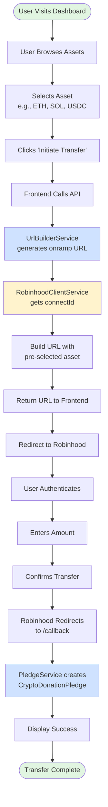
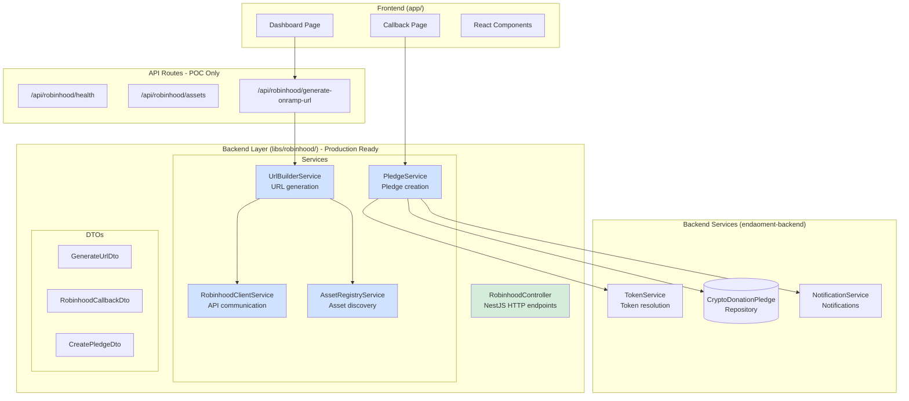
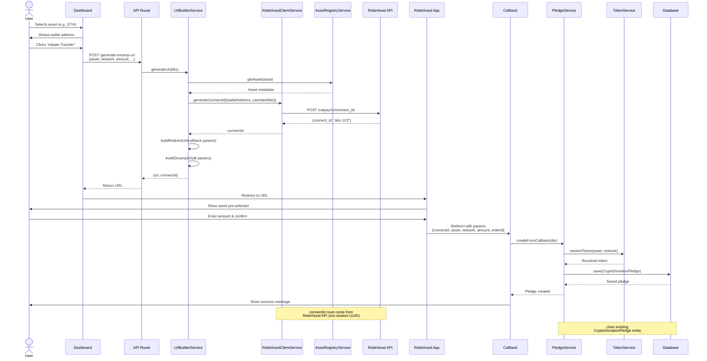
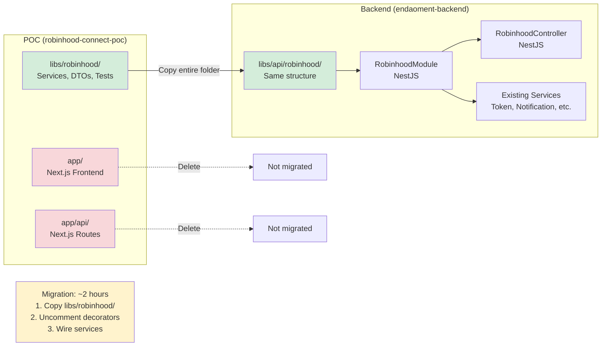
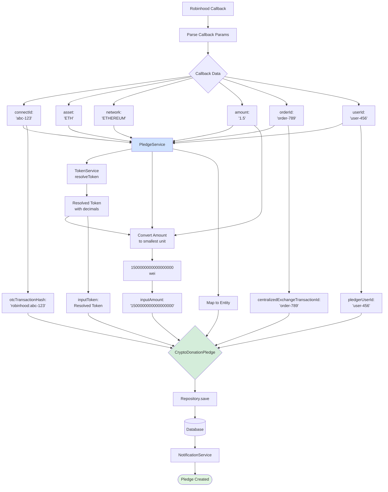

# Robinhood Connect - Flow Diagrams

Visual representations of the Robinhood Connect **onramp** (transfer FROM Robinhood) flow with backend-aligned architecture.

> **Note**: These diagrams reflect the current backend-aligned architecture with service layer, DTOs, and proper separation of concerns.

---

## Table of Contents

1. [High-Level User Flow](#1-high-level-user-flow)
2. [Service Layer Architecture](#2-service-layer-architecture)
3. [Detailed Sequence Diagram](#3-detailed-sequence-diagram)
4. [Backend Migration Flow](#4-backend-migration-flow)
5. [Data Flow - Pledge Creation](#5-data-flow---pledge-creation)

---

## 1. High-Level User Flow



---

## 2. Service Layer Architecture



---

## 3. Detailed Sequence Diagram



---

## 4. Backend Migration Flow



---

## 5. Data Flow - Pledge Creation



---

## Key Architecture Highlights

### ✅ Service Layer

- **RobinhoodClientService** - Robinhood API communication
- **AssetRegistryService** - Asset discovery and metadata
- **UrlBuilderService** - URL generation with validation
- **PledgeService** - Pledge creation and mapping

### ✅ DTO Validation

- **GenerateUrlDto** - Validates URL generation parameters
- **RobinhoodCallbackDto** - Validates callback data
- **CreatePledgeDto** - Validates pledge creation

### ✅ Backend Integration

- Uses existing **CryptoDonationPledge** entity
- Integrates with **TokenService** for token resolution
- Integrates with **NotificationService** for alerts
- Complete field mapping documented

### ✅ Testing

- 183 tests with 98%+ coverage
- Jest + nock for HTTP mocking
- AAA pattern (Arrange-Act-Assert)
- All services thoroughly tested

---

## Migration Notes

### POC to Backend

**What gets migrated**:

- ✅ `libs/robinhood/` → Complete NestJS module
- ❌ `app/` → Deleted (Next.js specific)

**Migration time**: ~2 hours

**Steps**:

1. Copy `libs/robinhood/` to backend
2. Uncomment module/controller decorators
3. Wire real services (replace mocks)
4. Run 183 tests
5. Deploy

See [MIGRATION-GUIDE.md](../MIGRATION-GUIDE.md) for complete instructions.

---

## Rendering These Diagrams

### In GitHub

GitHub natively supports Mermaid - diagrams render automatically.

### Locally

```bash
# Install Mermaid CLI
npm install -g @mermaid-js/mermaid-cli

# Generate PNG
mmdc -i FLOW-DIAGRAMS.md -o flow-diagrams.png

# Generate SVG
mmdc -i FLOW-DIAGRAMS.md -o flow-diagrams.svg
```

### Online

- [Mermaid Live Editor](https://mermaid.live)
- Copy/paste diagram code
- Export as PNG/SVG/PDF

---

## Related Documentation

- [ARCHITECTURE.md](./ARCHITECTURE.md) - Complete architecture documentation
- [MIGRATION-GUIDE.md](../MIGRATION-GUIDE.md) - Backend integration guide
- [TESTING_GUIDE.md](./TESTING_GUIDE.md) - Testing documentation
- [DEVELOPER_GUIDE.md](./DEVELOPER_GUIDE.md) - Development setup

---

**Last Updated**: October 25, 2025  
**Version**: v1.0.0 (Backend-Aligned)  
**Status**: Current and accurate
